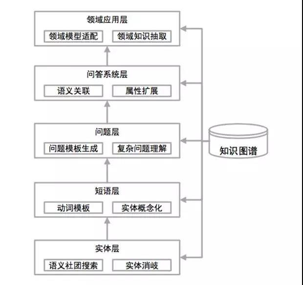

# HW7 基于知识图谱的问答系统

回答老师上课反复强调的问题：

词向：查询语句经过ltp语义角色分析、语义依存关系分析等步骤后获得的词。

文档：对原始文本进行类似处理后生成的三元组

本次作业的大致思路



## 需求分析

- 可视化要求不高
- 问答系统，返回结果而非URL

## 数据分析

- 数据获取

完成网页爬取非结构化文本数据

```text
南开大学人事人才 11月25日上午，南开大学人事处党支部在八里台校区办公楼521集中组织党员干部参观了“伟大历程 辉煌成就——庆祝中华人民共和国成立70周年大型成就展”的网上展馆。数字化网上展馆通过网络手段，以新媒体平台为依托，全要素呈现展览内容，全景式还原现场体验，采取多媒体互动叠加图文、音视频等形式，生动再现展览全貌。 网上展馆以“开辟和发展中国特色社会主义道路，建设社会主义现代化国家”为主题，通过“序厅、屹立东方、改革开放、走向复兴、人间正道”五个展厅，展示了我国从1949年建国以来70周年的发展历程。

```

- 数据预处理

ltp给出的实体关系抽取结果为

    # [
    #     [
    #         (1, [('ARG0', 0, 0), ('ARG1', 2, 2), ('ARG2', 3, 5)]), # 叫 -> [ARG0: 他, ARG1: 汤姆, ARG2: 拿外衣]
    #         (4, [('ARG0', 2, 2), ('ARG1', 5, 5)])                  # 拿 -> [ARG0: 汤姆, ARG1: 外衣]
    #     ]
    # ]
    
[点击此处](https://ltp.readthedocs.io/zh_CN/latest/appendix.html#id4)查看标签含义
    

- 数据结构与存储

**MongoDB**(字典) or **neo4j**(图：节点、关系)

查阅了资料，发现他们之间是有一些相似，但是如果使用MongoDB则需要编写较为复杂的查询语句，并且维护相对难度较大，因此选择neo4j

**存储什么？**

三元组的文本内容，以及一些属性，比如关系强度等

## 知识图谱构建

利用生成的三元组构建相应的cypher语句，将数据持久化到neo4j

```cypher
merge (m:A0{name:'南开大学'})-[r:迎来]-(n:A1{name:'建校100周年华诞'}) ON CREATE SET r.value=1 on match set r.value=r.value+1;
merge (m:A0{name:'南开大学'})-[r:成为]-(n:A1{name:'享誉海内外的著名学府'}) ON CREATE SET r.value=1 on match set r.value=r.value+1;
merge (m:A0{name:'南开大学'})-[r:秉承]-(n:A1{name:'“文以治国、理以强国、商以富国”理念'}) ON CREATE SET r.value=1 on match set r.value=r.value+1;
merge (m:A0{name:'周恩来'})-[r:是]-(n:A1{name:'首期学生之一'}) ON CREATE SET r.value=1 on match set r.value=r.value+1;
merge (m:A0{name:'最后排左一'})-[r:为]-(n:A1{name:'周恩来'}) ON CREATE SET r.value=1 on match set r.value=r.value+1;
merge (m:A0{name:'南开大学'})-[r:角迁]-(n:A2{name:'八里台'}) ON CREATE SET r.value=1 on match set r.value=r.value+1;
merge (m:A0{name:'图'})-[r:为]-(n:A1{name:'早期南开大学校园南部全景'}) ON CREATE SET r.value=1 on match set r.value=r.value+1;

```


## 查询逻辑及结果展示

对用户的查询语句进行语义实体识别，分析用户的查询逻辑，并给出结果


## 待改进的地方

- 实体消歧，合并具有相同意思的节点
- 问题模板生成
- 存储更多的信息，比如定状补等修饰语，并根据用户的查询来实现更好的结果返回
- 模糊查询、差错校正等